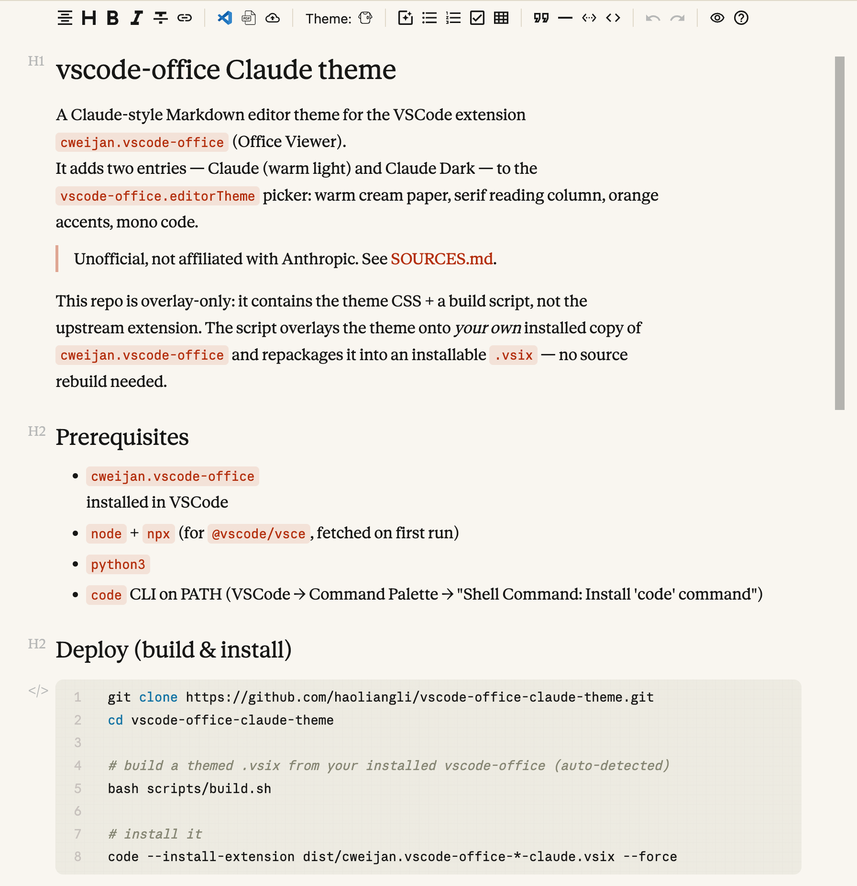
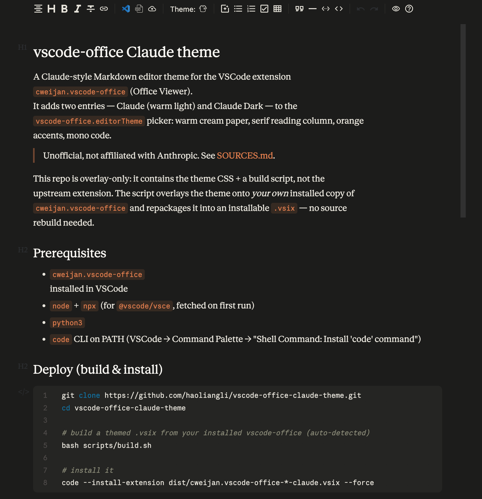

# vscode-office Claude theme

[](https://github.com/haoliangli/vscode-office-claude-theme/actions/workflows/ci.yml)
[](LICENSE)

A **Claude-style Markdown editor theme** for the VSCode extension
[`cweijan.vscode-office`](https://github.com/cweijan/vscode-office) (Office Viewer).
It adds two entries — **Claude** (warm light) and **Claude Dark** — to the
`vscode-office.editorTheme` picker: warm cream paper, serif reading column, orange
accents, mono code.

> Unofficial, not affiliated with Anthropic. See [SOURCES.md](SOURCES.md).

This repo is **overlay-only**: it contains the theme CSS + a build script, not the
upstream extension. The script overlays the theme onto *your own* installed copy of
`cweijan.vscode-office` and repackages it into an installable `.vsix` — no source
rebuild needed.

## Preview

The editor rendering this very README, in both variants:

| Claude (warm light) | Claude Dark |
| :--: | :--: |
|  |  |

## Prerequisites

- [`cweijan.vscode-office`](https://marketplace.visualstudio.com/items?itemName=cweijan.vscode-office)
  installed in VSCode
- `node` + `npx` (for `@vscode/vsce`, fetched on first run)
- `python3`
- `code` CLI on PATH (VSCode → Command Palette → "Shell Command: Install 'code' command")

## Deploy (build & install)

```sh
git clone https://github.com/haoliangli/vscode-office-claude-theme.git
cd vscode-office-claude-theme

# build a themed .vsix from your installed vscode-office (auto-detected)
bash scripts/build.sh

# install it
code --install-extension dist/cweijan.vscode-office-*-claude.vsix --force
```

Then in VSCode:

1. **Reload Window** (Command Palette → "Developer: Reload Window") — required so the
   patched files load.
2. Settings → **`vscode-office.editorTheme`** → **Claude** (or **Claude Dark**).
   Or use the in-editor "Select Editor Theme" picker.
3. Open a `.md` with the Office Viewer editor (reopen the tab if it doesn't apply).
4. *(light theme)* set `vscode-office.previewCodeHighlight.style` to `github` for a
   coherent code-block look.

### Keep it from being overwritten

A custom `.vsix` shares the id `cweijan.vscode-office`, so the Marketplace may
auto-update over it. In the Extensions view, right-click **Office Viewer → "Disable Auto
Update (this extension)"**. Re-run the build when you deliberately move to a newer
upstream version: `bash scripts/build.sh /path/to/new/cweijan.vscode-office-X.Y.Z`.

## Exact Claude fonts (optional)

The theme works out of the box with open/system serifs (Georgia / Noto Serif SC /
Songti SC). For the **exact** Claude typography it also uses Anthropic's fonts — which
are **proprietary (© Anthropic PBC) and are not distributed with this repo**. To use
them, supply your own copies one of two ways:

- drop the `.ttf` files into `overlay/resource/vditor/css/fonts/` (git-ignored), **or**
- point `FONT_SRC` at a folder that has them:
  `FONT_SRC=/path/to/fonts bash scripts/build.sh`

The relevant files: `AnthropicSerifWebText.ttf`, `AnthropicSansWebText.ttf`,
`AnthropicMonoVariable.ttf`, and `NotoSerifSC-VariableFont_wght.ttf`. They are bundled by
the [claude-typora-theme](https://github.com/Tsumugii24/claude-typora-theme) project,
among other sources. (Noto Serif SC is also freely available from Google Fonts.)

## How it works

`vscode-office`'s Markdown editor is vditor-based. The build (`scripts/inject.py`)
makes three additive patches to a copy of your installed extension, then `vsce package`s it:

1. `resource/vditor/css/theme/Claude.css` + `Claude Dark.css` — the theme (palette,
   serif type, reading column).
2. `package.json` → adds `Claude` / `Claude Dark` to the `editorTheme` enum (Settings UI).
3. `out/extension.js` → adds them to the hardcoded "Select Editor Theme" quick-pick.
4. `base.css` → injects `@font-face` (Anthropic fonts inlined as base64 if supplied,
   Noto Serif SC via url) + outline tweaks.

No upstream source is modified or redistributed. See [SOURCES.md](SOURCES.md).

## License

[MIT](LICENSE) © Haoliang Li — covers the CSS and scripts only. Third-party fonts are
not included and retain their own licenses.
